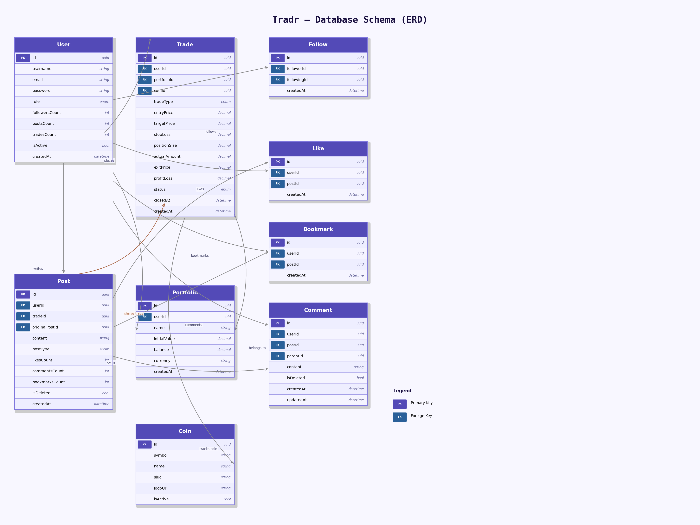

# Tradr – Crypto Social Trading Platform

Tradr is a full-stack crypto social trading platform inspired by Investagrams and Involio. It combines X.com-style social features with real-time crypto trade tracking, allowing users to share trades, follow other traders, and build a public portfolio — all in one place.

> 🚧 Frontend is partially complete. Core features are functional; some pages are still in progress.

---

## Tech Stack

**Backend**
- Node.js, Express.js
- PostgreSQL, Prisma ORM
- JWT Authentication (HttpOnly Cookies)
- Cloudinary (media uploads)
- Binance WebSocket API (real-time price caching)

**Frontend**
- React, React Router
- Tailwind CSS
- Axios

---

## Features

### Auth
- JWT-based authentication with HttpOnly cookies
- Session hydration via `/api/auth/me`
- Protected routes on the frontend

### Social
- Follow / Unfollow users
- Create, like, bookmark, and comment on posts
- Repost other users' posts
- Explore and search users

### Trading
- Open, update, and close trades
- Automatic P&L calculation on trade close
- Portfolio tracking with fixed initial value benchmark
- Real-time coin prices via Binance WebSocket (in-memory cache, no per-tick DB writes)

### Feed & Profile
- Personalized feed from followed users
- Public profile pages with trade history and portfolio stats
- Bookmarks page
- Pagination across feed and explore

---

## Architecture Notes

- **Trades vs Posts** — Trades are pure financial records. Social interactions (sharing a trade publicly) flow through Posts, keeping the data model clean.
- **Portfolio P&L** — Portfolio has a fixed `initialValue` as benchmark and a `balance` that updates only on trade close, ensuring accurate return calculation.
- **Price Caching** — Binance WebSocket prices are stored in memory and never persisted per tick, avoiding DB write flooding while keeping prices near real-time.
- **Media Uploads** — Handled via Cloudinary with direct upload from the frontend.

---

## Status

| Layer | Status |
|---|---|
| Backend API | ✅ Complete |
| Auth & Sessions | ✅ Complete |
| Social Features | ✅ Complete |
| Trade Tracking | ✅ Complete |
| Frontend – Core Pages | ✅ Complete |
| Frontend – Remaining Pages | 🚧 In Progress |

---
## Database Design (ER Diagram)

The following diagram represents the relational structure of the platform, including user interactions, social features, and trading data.
> Trades are decoupled from Posts to maintain financial data integrity while enabling social sharing.

---
## Author

**Tushar Kachare** — Self-guided solo project
